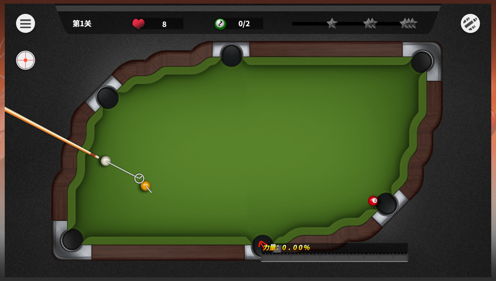
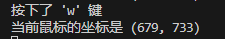
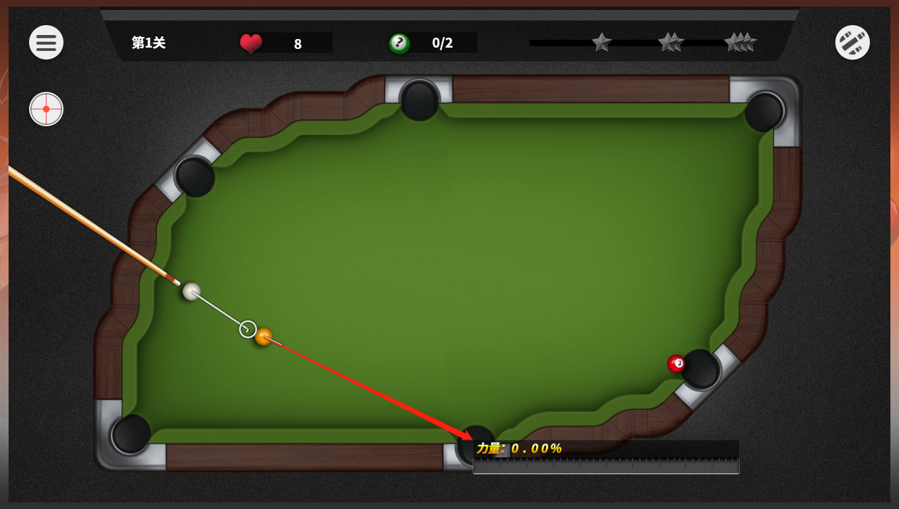

# qqtable

QQ桌球辅助瞄准工具

打台球的时候感叹QQ桌球的辅助瞄准线太短，想做一个辅助瞄准的工具。

与别的工具不同，这个脚本只能辅助瞄准，需要手动标点。	

## 使用方法：

1.将鼠标放在目标点后按下Q键标记目标点坐标；

!(./assets/image-20230920223329327.png)

2.将鼠标放在目标球后按下W键标记目标球的坐标；（QW键对应两个端点可以互换）

3.**长按E键**划出球的理想轨迹。

此时程序已经记录下两点的坐标，按下e键划出线段。

使用游戏自带的白色瞄准辅助线对准脚本画出的黑线，力度拉满，即可实现精准打击。

## 原理讲解：

 

### 定义理想轨迹的两个端点坐标

\# 设置线段的起始和结束点坐标

start_x, start_y = 100, 100

end_x, end_y = 400, 400

### 按下Q键的时候记录鼠标的位置为一个端点坐标

​    elif key.char == 'q':

​      print("按下了 'q' 键")

​      print("当前鼠标的坐标是",mouse.position)

​      start_x=mouse.position[0]

​      start_y=mouse.position[1]

​      win32gui.MoveToEx(hdc, start_x, start_y)

### 按下W键的时候记录鼠标的位置为另一个端点坐标

​    elif key.char == 'w':

​      print("按下了 'w' 键")

​      print("当前鼠标的坐标是",mouse.position)

​      \# win32gui.MoveToEx(hdc, start_x, start_y)

​      end_x=mouse.position[0]

​      end_y=mouse.position[1]

​      win32gui.LineTo(hdc, end_x, end_y)

### 按下E键的时候画出线段

​    elif key.char == 'e':

​      print("按下了 'e' 键")

​      print("当前鼠标的坐标是",mouse.position)

​      win32gui.MoveToEx(hdc, start_x, start_y)

​      win32gui.LineTo(hdc, end_x, end_y)
